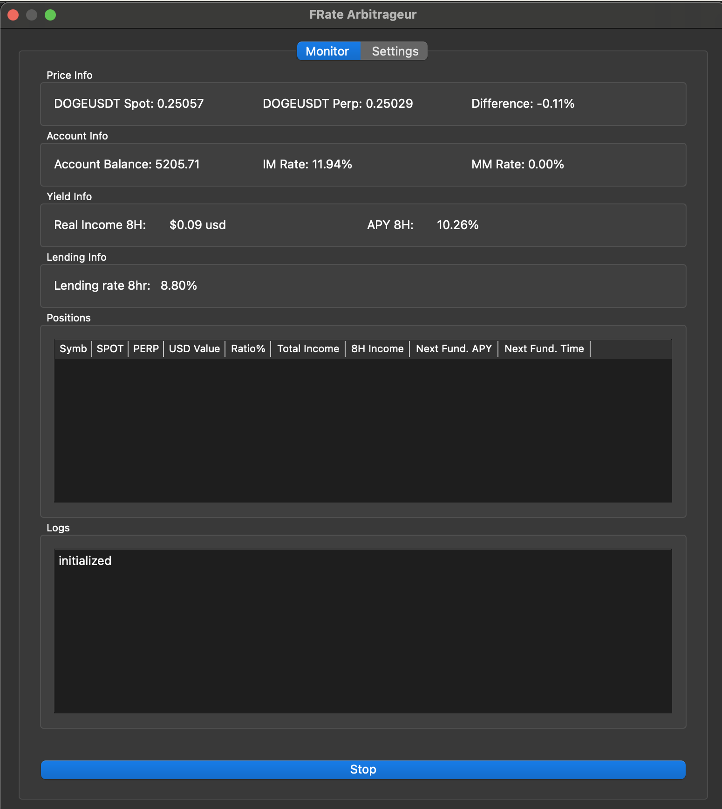
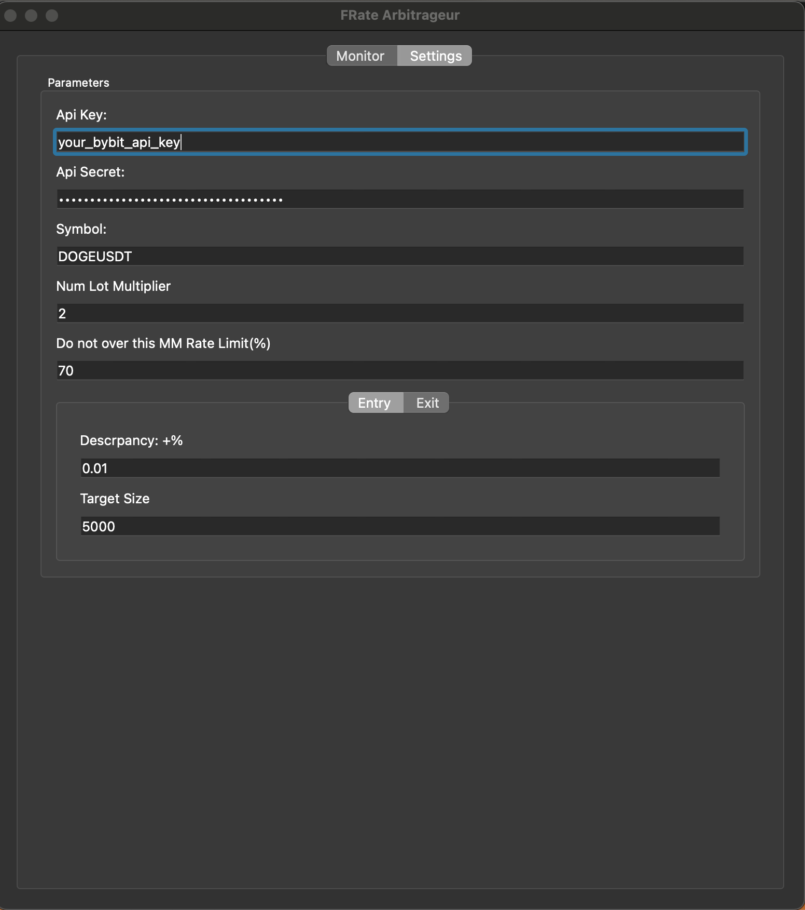

# Bybit FRate Desktop

Bybit FRate Desktop is a desktop application built with PyQt5 that enables cryptocurrency traders to monitor and execute funding rate arbitrage strategies between spot and perpetual markets. This market-neutral strategy capitalizes on funding rate mechanisms in crypto exchanges.


## Features

- **Real-time Price Monitoring**
  - Live spot and perpetual prices tracking
  - Price discrepancy calculation and display
  - Funding rate monitoring

- **Account Management**
  - Real-time account balance tracking
  - Position monitoring
  - Initial Margin (IM) and Maintenance Margin (MM) rate tracking

- **Yield Analytics**
  - 8-hour real income tracking
  - APY calculations
  - Lending rate monitoring

- **Flexible Trading Parameters**
  - Customizable entry/exit price discrepancy thresholds
  - Adjustable position sizes
  - Lot size multiplier settings

- **Position Management**
  - Detailed position information table
  - Total income and 8-hour income tracking
  - Next funding time and APY predictions

## Installation

1. Clone the repository:
```bash
git clone https://github.com/cryptic-core/bybit-frate-desktop.git
cd bybit-frate-desktop
```

2. Install required dependencies:
```bash
pip install -r requirements.txt
```

3. Run the application:
```bash
python mainapp.py
```

## Usage

### 1. Initial Setup
- Navigate to the Settings tab
- Enter your API credentials
- Configure your target trading symbol (e.g., BTCUSDT)
- Set your preferred MM Rate limit

### 2. Trading Configuration
#### Entry Mode
- Set desired price discrepancy percentage for entry
- Configure target position size
- Click "Start Entry" to begin monitoring for opportunities

#### Exit Mode
- Set desired price discrepancy percentage for exit
- Configure target exit size
- Click "Start Exit" to begin monitoring for closing opportunities

### 3. Monitoring
The Monitor tab provides real-time information including:
- Current spot and perpetual prices
- Price discrepancy
- Account balance and margin rates
- Real income and APY calculations
- Active positions and their performance

## Screenshots

### Monitor Tab

*Real-time monitoring of prices, positions, and yields*

### Settings Tab

*Configuration interface for API keys and trading parameters*

## Important Notes

- Always test with small positions first
- Monitor your margin rates carefully
- Ensure your API keys have appropriate trading permissions
- Keep your API credentials secure

## Risk Warning

Cryptocurrency trading involves significant risk. This tool is for educational and informational purposes only. Always conduct your own research and risk assessment before trading.

## License

[MIT License](LICENSE)

## Contributing

Contributions are welcome! Please feel free to submit a Pull Request.